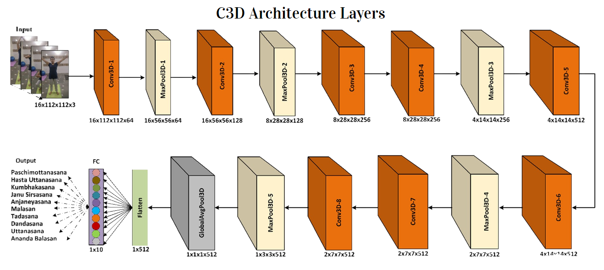

# Yoga-Pose-Estimation-using-3D-CNN
This work was done as part of my final year project for my MSc coursework.
Applied different methodologies to estimate the Yoga Pose performed by the practitioner.
Performed Yoga Pose Estimation using two different architectures, namely C3D Architecture and MoViNet Architecture.

## C3D Architecture:
1. Popular for video analysis on Human Action Recognition tasks
2. Uses 3-D Convolutional Neural Networks
  * Conv3D Layers
  * MaxPool3D Layers
  * AvgPool3D Layers
3. Uses 3-D Kernels to perform Convolution

### Pre-processing Pipeline
1. Packages Used
  * OpenCV
  * MoviePy
  * FFmpeg
2. Pre-processings performed
  * The long yoga asana clip is converted in smaller 16 frame clips.
5. Augmentation Strategies Used
  * Several augmentation strategies were performed on the videos. The image below shows them.

 
### Neural Network Training
1. Input Image Size : 16 x 16 x 112 x 112 x 3
2. Loss Function : Categorical Cross Entropy
3. Optimization Parameters : Stochastic Gradient Descent
* Learning Rate : 0.001, Momentum : 0.9
4. Nesterov Accelerated Gradients
5. ReduceLROnPlateau
* Patience : 3, Factor : 0.1
6. Number of Epochs : 50
7. Batch Size : 16
8. GPU : NVIDIA Tesla P100 (3584 CUDA Cores)
9. RAM : 16 GB

## Results
1. Drastic reduction in the training and validation loss upon training.
2. But the model learning is very minimal.

INSERT IMAGE HERE.

## MoViNet Architecture
1. Family of deep learning network for video recognition tasks.
2. Optimized for mobile and embedded devices.
3. The important components of MoViNet:
* Video Network Search Space
* Stream Buffer
* Ensemble Learning
4. Two-stream architecture
* Spatial Information [2-D Conv on each frame (Spatial stream)]
* Temporal Information [1-D Conv on the sequence (Temporal stream)]
